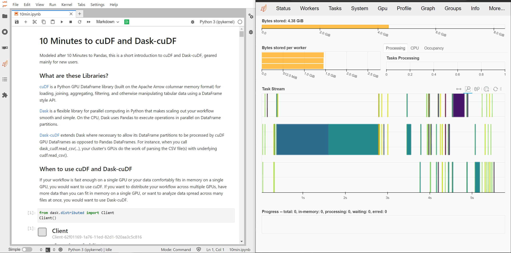

Dask Helm Chart
===============

This guide provides an entry point to deploy RAPIDS into Kubernetes cluster via helm chart,
using [dask/helm-chart](https://github.com/dask/helm-chart) as the starting point.
This guide will walk through steps to set up a scalable rapids cluster,
demonstrating GPU accelerated notebook workflows and scaling up and down the cluster.
## From Dask helm chart to RAPIDS helm chart

Built on top of dask-helm-chart,
`rapids-config.yaml` file contains additional configurations required to setup RAPIDS environment.

```{literalinclude} ./dask-helm-chart/rapids-config.yaml
:language: yaml
```

`*.images.*` is updated with the RAPIDS "runtime" image from the stable release,
which includes environment necessary to launch run accelerated libraries in RAPIDS,
and scaling up and down via dask.
Note that all scheduler,
woker and jupyter pods are required to use the same image.
This ensures that dask scheduler and worker versions match.

`*.env` is required as of current rlease as a workaround for limitations in the image.
May be removed in the future.

`worker.resources` exlicitly requests GPU for each worker pod,
required by many accelerated libraries in RAPIDS.

`worker.dask_worker` is the launch command for dask worker inside worker pod.
To leverage the GPU resource each pod has,
[`dask_cuda_worker`](https://docs.rapids.ai/api/dask-cuda/stable/index.html) is launched in place of the regular `dask_worker`.

If desired to have a different jupyter notebook password than default,
compute the hash for `<your-password>` and update `jupyter.password`.

Deploy `rapids-helm-chart`:
```bash
helm repo add dask https://helm.dask.org
helm repo update

helm install rapids-release dask/dask -f dask-helm-chart/rapids-config.yaml
```

<!-- TODO: update link with https://artifacthub.io/packages/helm/dask/dask after next helm chart release -->
This will deploy the cluster with the same topography as dask helm chart,
see [dask helm chart documentation for detail](https://github.com/dask/helm-chart/blob/main/dask/.frigate).


```{note}
By default,
`dask-helm-chart` will not create any `Ingress`.
Custom `Ingress` may be configured to consume external traffic and redirect to corresponding services.
```

For simplicify, this guide will setup access to jupyter notebook via port forwarding.

## Running Rapids Notebook

First, setup port forwarding from the cluster to external port:

```bash
# For Jupyter notebook
kubectl port-forward --address 127.0.0.1 service/rapids-release-dask-jupyter 8888:80 &
# For Dask scheduler
kubectl port-forward --address 127.0.0.1 service/rapids-release-dask-scheduler 8787:80 &
```

Open a browser and access `localhost:8888` for jupyter notebook,
and `localhost:8787` for dask dashboard.
Enter password (default is `rapids`) and access the notebook environment.

### Notebooks and Cluster Scaling

Open `10 Minutes to cuDF and Dask-cuDF` notebook under `cudf/10-min.ipynb`.
Conveniently,
the helm chart preconfigures the scheduler address in client's environment.
To examine the cluster,
simply create a client:

```python
from dask.distributed import Client

Client()
```

By default,
we can see 3 workers are created and each has 1 GPU assigned.


Walk through the examples to validate that the dask cluster is setup correctly,
and that GPU is accessible for the workers.
Worker metrics can be examined in dask dashboard.



In case you want to scale up the cluster with more GPU workers,
you may do so via `kubectl` or via `helm upgrade`.

```bash
# via `kubectl`
kubectl scale deployment rapids-release-dask-worker --replicas=8
```

```bash
# via `helm upgrade`
# Modify `worker.replicas` in `values.yaml` to 8, then run
helm upgrade -f dask-helm-chart/rapids-config.yaml  dask/dask rapids-release
```


