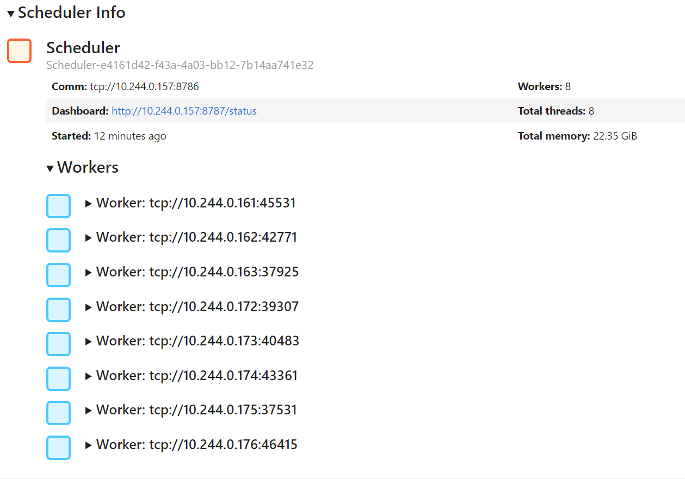

Dask Helm Chart
===============

This guide provides an easy entry point to deploy RAPIDS into Kubernetes cluster via helm chart,
using [dask/helm-chart](https://github.com/dask/helm-chart) as the starting point.
This guide will walk through steps to set up a scalable rapids cluster,
demonstrating GPU accelerated notebook workflows and scaling up and down the cluster.
## From Dask helm chart to RAPIDS helm chart

TL;DR, clone [dask/helm-chart](https://github.com/dask/helm-chart),
and modfiy the following key-value pairs in `dask/values.yaml`.

Key | Value
---|---
scheduler.images.repository | rapidsai/rapidsai-core
scheduler.images.tag | 22.06-cuda11.5-runtime-ubuntu20.04-py3.9
worker.images.repository | rapidsai/rapidsai-core
worker.images.tag | 22.06-cuda11.5-runtime-ubuntu20.04-py3.9
jupyter.images.repository | rapidsai/rapidsai-core
jupyter.images.tag | 22.06-cuda11.5-runtime-ubuntu20.04-py3.9
worker.dask_worker | "dask-cuda-worker"

Add the following new items:

Key | Value 
---|---
scheduler.env | {name: DISABLE_JUPYTER, value: "true"}
worker.env | {name: DISABLE_JUPYTER, value: "true"}
worker.resources.limits.cpu | 1
worker.resources.limits.memory | 3G
worker.resources.limits.nvidia.com/gpu | 1
worker.resources.requests.cpu | 1
worker.resources.requests.memory | 3G
worker.resources.requests.nvidia.com/gpu | 1

If desired to have a different jupyter notebook password than default,
compute the hash for `<your-password>` and update:

Key | Value 
---|---
jupyter.password | `hash(<your-password>)`

<details>
<summary>Detailed explainations</summary>

`*.images.*` is updated with the RAPIDS "runtime" image from the stable release,
which includes environment necessary to launch run accelerated libraries in RAPIDS,
and scaling up and down via dask.
Note that all scheduler,
woker and jupyter pods are required to use the same image.
This ensures that dask scheduler and worker versions match.

`*.env` is required as of release 22.08 as a workaround for limitations in the image.
May be removed in the future.

`worker.resources` exlicitly requests GPU for each worker pod,
required by many accelerated libraries in RAPIDS.

`worker.dask_worker` is the launch command for dask worker inside worker pod.
To leverage the GPU resource each pod has,
[`dask_cuda_worker`](https://docs.rapids.ai/api/dask-cuda/stable/index.html) is launched in place of the regular `dask_worker`.

</details>

Deploy the modified helm-chart via for single user use:
```
helm install rapids-release dask/
```

This will deploy the cluster with the same topography as dask helm chart,
see [dask helm chart documentation for detail](https://github.com/dask/helm-chart/blob/main/dask/.frigate).

Note that no `Ingress` is created.
Custom `Ingress` may be configured to consume external traffic and redirect to corresponding services.
For simplicify, this guide will setup access to jupyter notebook via port forwarding.

## Running Rapids Notebook

First, setup port forwarding from the cluster to external port:

```bash
# For Jupyter notebook
kubectl port-forward --address 127.0.0.1 service/rapids-release-dask-jupyter 8888:80 &
# For Dask scheduler
kubectl port-forward --address 127.0.0.1 service/rapids-release-dask-scheduler 8889:80 &
```

For users accessing the notebooks from remote machine,
ssh-tunneling is required.
Otherwise,
open a browser and access `localhost:8888` for jupyter notebook,
and `localhost:8889` for dask dashboard.
Enter password (default is `dask`) and access the notebook environment.

### Notebooks and Cluster Scaling

RAPIDS is a GPU accelerated,
scalable environment suitable for various data science workflow.
[`10 Minutes to cuDF and Dask-cuDF`](https://docs.rapids.ai/api/cudf/stable/user_guide/10min.html)
notebook demonstrates using [`cuDF`'s](https://docs.rapids.ai/api/cudf/stable/) pandas-like API
to accelerate the workflow on GPU.
The notebook is hosted in `cudf` folder,
so be sure to take the time and walk through the notebook!

<!-- TODO: Image to demonstrate the dashboard with the usage of the workers -->

In cluster server,
execute the following to retrieve the IP address of the scheduler:
```
kubectl get svc -l component=scheduler,release=rapids-release
```

```python
from dask.distributed import Client

client = Client(<your-scheduler-ip-address:8786>)
client
```


By default,
we can see 3 workers are scheduled.
Each has 1 GPU assigned.
In case you want to scale up the cluster with more GPU workers,
you may do so via `kubectl` or via `helm upgrade`.

```bash
# via `kubectl`
kubectl scale deployment rapids-release-worker --replicas=8
```

```bash
# via `helm upgrade`
# Modify `worker.replicas` in `values.yaml` to 8, then run
helm upgrade rapids-release rapids/
```


